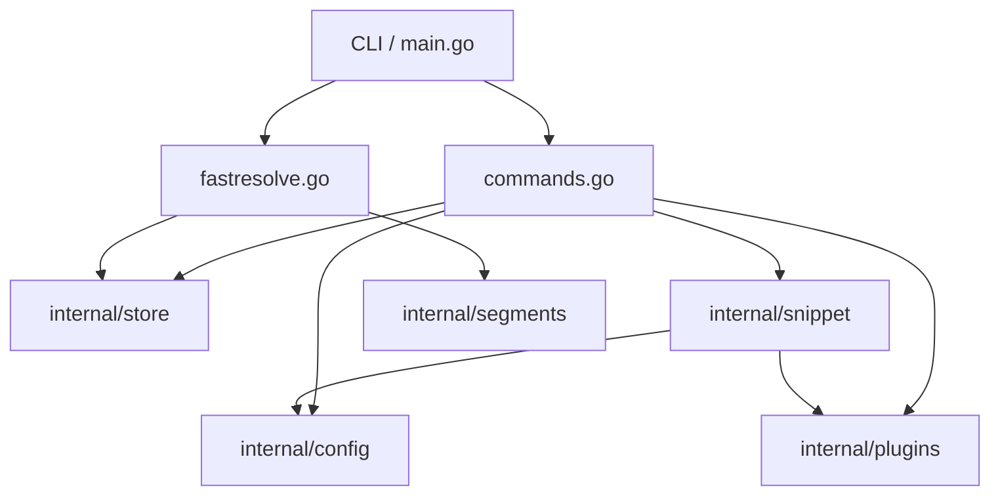

# onix

Fast directory alias resolver for Windows PowerShell and Linux (Bash/Zsh). Type `o acme` from any prompt; your shell jumps to the project root. One TOML file holds every alias, one binary serves every command, and the hot path adds about 0.6 ms on top of the OS process-spawn floor.

## Install

```bash
# On Windows (PowerShell)
go install github.com/sadirano/onix@latest
onix init

# On Linux (Bash/Zsh)
go install github.com/sadirano/onix@latest
onix init
```

`onix init` creates `~/.onix/`, writes a shell snippet to `~/.onix/shell/`, and sources it from your shell profile (`$PROFILE` on Windows, `.bashrc` or `.zshrc` on Linux). Restart your shell (or source your profile) once and the short commands below are live.

## Use

```powershell
onix add acme C:\Users\dev\projects\acme   # register an alias (auto-creates the dir if missing)
o acme                                     # cd into it (in your current shell)
o acme C:\Users\dev\projects\acme          # register + cd in one step (dir auto-created)
o                                          # no args: open aliases.toml in your editor
n acme                                     # open it in your editor
s acme                                     # open it in Explorer
y acme                                     # print the path and copy to clipboard
r acme go test ./...                       # run a command at that path
onix list                                  # show every alias
onix aliases                               # open aliases.toml in your editor
onix remove acme                           # forget it
```

The `o` command changes the **current** shell's working directory — it does not spawn a new shell. Three forms:

- `o <alias>` — resolve and cd. If the alias is unknown, `o` prompts for a destination, registers, and cds.
- `o <alias> <path>` — register (or update) the alias to point at `<path>` and cd there. The directory is auto-created if it doesn't exist.
- `o` (no args) — open `aliases.toml` in `$EDITOR`. Use `onix list` if you want a tabular dump to stdout instead.

Everything else (`n`, `s`, `y`, `r`) invokes `onix` directly, so those don't need shell integration to work.

## Configuration

Aliases live in `~/.onix/aliases.toml`. The format is one TOML table per alias:

```toml
[acme]
path = "C:/Users/dev/projects/acme"
```

You can hand-edit the file (`onix list` and resolve will pick up changes immediately) or use `onix add` / `onix remove`. Alias lookups are case-insensitive.

Editor is taken from `$EDITOR` (falls back to `nvim`). Override the onix home location with `$ONIX_HOME`.

## Custom actions

Declare your own shortcuts in `~/.onix/config.toml`. Each becomes a real PowerShell function that takes an alias and remaining args:

```toml
[[actions]]
name = "test"
exec = "go"
args = ["test", "./..."]

[[actions]]
name = "pr"
exec = "gh"
args = ["pr", "view", "{extras}", "--web"]
```

After editing, run `onix install-actions` and `. $PROFILE` (or restart PowerShell). Then `test acme` runs `go test ./...` at the resolved acme path, and `pr acme 42` runs `gh pr view 42 --web`.

Template variables: `{target}` is the resolved path, `{alias}` is the alias name, `{extras}` is the rest of the args (variadic when used as a whole arg). Extras are appended automatically when `{extras}` isn't present in `args`.

## Sub-aliases (`@`-segments)

Append subdirectory shortcuts to any alias with `@`:

```powershell
o docs@acme              # cd into <acme-path>/documentation
n src@acme               # editor at <acme-path>/source
o ts@acme                # tests subdir
o anything@acme          # falls back to literal: <acme-path>/anything
o sub1@sub2@acme         # multi-segment, innermost first: <acme-path>/sub2/sub1
```

Define the global registry in `~/.onix/segments.toml`:

```toml
[subdirs]
docs = "documentation"
src  = "source"
ts   = "tests"
```

Per-alias overrides live next to the alias entry:

```toml
[acme]
path = "C:/projects/acme"

[acme.subdirs]
docs = "doc-internal"    # this acme uses a different docs layout
```

Lookup order is per-alias subdirs → global registry → literal fallback, so unregistered segments still navigate sensibly without setup. Lookups are case-insensitive.

## Plugins

External plugins extend onix beyond what custom actions can do. A plugin is its own Go binary, cloned from a GitHub repo, pinned to a commit, and dispatched against an alias the same way built-in actions are.

```powershell
onix plugin add sadirano/onix-tts --sha abc123def456   # install at a pinned SHA
onix plugin add C:\path\to\local-checkout --unpinned   # local source for development
onix plugin list                                       # show installed plugins + SHAs
onix plugin update tts                                 # refetch and rebuild
onix plugin update tts --sha <newhash>                 # bump the pin (re-confirms)
onix plugin remove tts                                 # uninstall
```

Each install prompts before building — you see the repo URL, resolved SHA, commit message, and the wrapper names that will land in your shell. `--yes` skips the prompt for automation. `--unpinned` tracks the default branch (rebuilds may install new upstream code without re-prompting; use with caution).

Plugin authors put an optional `onix.toml` in their repo declaring entry points; each entry becomes its own shell wrapper, with `ONIX_ENTRY=<name>` set when the plugin runs. The plugin receives the resolved path via `ONIX_TARGET`, the alias name via `ONIX_ALIAS`, the onix home via `ONIX_HOME`, and any `config = {…}` block from `plugins.toml` as JSON in `ONIX_MODULE_CONFIG`.

Plugin wrappers participate in tab completion just like built-ins and custom actions.

## Tab completion

Every command that takes an alias (`o`, `n`, `s`, `y`, `r`, plus your custom actions and plugins) supports tab-completion of alias names. The completer calls `onix list-names` under the hood — a dedicated hot path that bypasses kong and go-toml for sub-millisecond Tab response.

## Commands

`onix init` initialises `~/.onix` and installs the PowerShell snippet (re-run any time; it's idempotent). `onix doctor` reports any installation issues. `onix version` prints the build version, Go runtime, and OS/arch. `onix --help` lists everything.

## Diagnostics

If `onix doctor` warns that your shell profile does not source the snippet, run `onix init` again without `--skip-profile`. On Windows this updates `$PROFILE`; on Linux/macOS it appends a `[ -f ... ] && . ...` line to `.bashrc` and/or `.zshrc`.

If `doctor` warns that `onix` is not on `PATH`, add `$env:USERPROFILE\go\bin` (Windows) or `~/go/bin` (Linux/macOS) to PATH and restart your shell. Shortcuts (`o`, `n`, `s`, `y`, `r`) work without `onix` on PATH because the snippet pins the binary location at install time; `PATH` only matters when you type `onix` directly. Zsh tab completion additionally requires `compinit` to be loaded in `.zshrc` before sourcing the snippet — without it, completion silently skips registration rather than erroring.

Set `$env:ONIX_HOME` to a different directory for sandboxed testing. The included `scripts/smoke.ps1` does exactly that — it builds, runs every command against a throwaway home, and measures the hot path.

## Status and scope

This release covers Windows (PowerShell) and Linux (Bash/Zsh), with built-in actions, custom actions from `config.toml`, SHA-pinned external plugins from `plugins.toml`, sub-alias subdir shortcuts from `segments.toml`, and cross-platform tab completion. Sub-alias context resolvers (env/cmd/file segments with templates), search shortcuts (`sg`, `ff`) as first-party features, and an optional daemon mode for sub-millisecond resolution are tracked but not in this build. Existing plugins like `onix-search`, `onix-find`, `onix-timer`, and `onix-tts` work as-is — they read the same `ONIX_TARGET`/`ONIX_ALIAS`/`ONIX_MODULE_CONFIG` env vars the v1 onix exposed.

## Architecture

Onix is designed for extreme performance on the hot path (`resolve`) while maintaining a clean, modular structure for management commands.



### Core Packages

- **`internal/store`**: Manages `aliases.toml`, the primary database of name-to-path mappings. Includes atomic write logic and name validation.
- **`internal/segments`**: Handles `@`-segment resolution and global subdirectory mappings in `segments.toml`.
- **`internal/config`**: Manages `config.toml`, where users define custom action wrappers with template substitution.
- **`internal/plugins`**: Handles external plugin installation, verification (SHA pinning), and execution environment.
- **`internal/snippet`**: Generates the PowerShell and Bash/Zsh glue code that integrates Onix into your shell.

## License

MIT.
