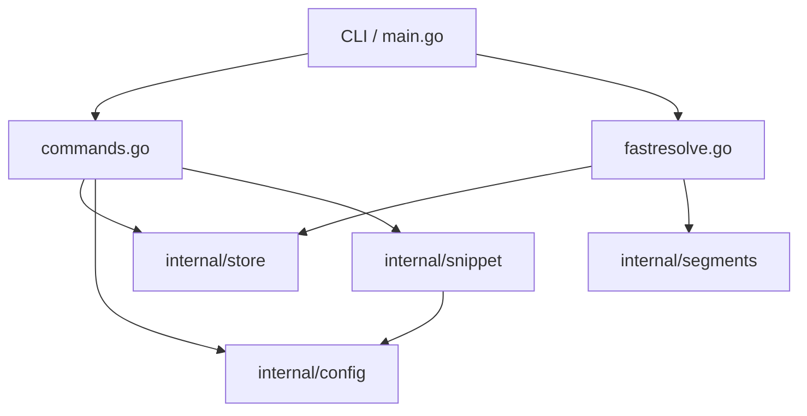

# onix

Fast directory alias resolver for Windows PowerShell and Linux (Bash/Zsh). Type `o acme` from any prompt; your shell jumps to the project root. One TOML file holds every alias, one binary serves every command, and the hot path adds about 0.6 ms on top of the OS process-spawn floor.

## Install

```bash
# On Windows (PowerShell)
go install github.com/sadirano/onix@latest
onix --init

# On Linux (Bash/Zsh)
go install github.com/sadirano/onix@latest
onix --init
```

`onix --init` creates `~/.onix/`, writes a shell snippet to `~/.onix/shell/`, and sources it from your shell profile (`$PROFILE` on Windows, `.bashrc`, `.zshrc`, or `.profile` on Unix-likes). Restart your shell (or source your profile) once and the short commands below are live.

## Use

```powershell
onix acme C:\Users\dev\projects\acme       # register an alias (auto-creates the dir if missing)
o acme                                     # cd into it (in your current shell)
o acme C:\Users\dev\projects\acme          # register + cd in one step (dir auto-created)
o                                          # no args: open aliases.toml in your editor
e acme                                     # open it in your editor
s acme                                     # open it in Explorer
s acme report.pdf                          # open a file with its default app (PDF→viewer, .zip→archiver…)
y acme                                     # print the path and copy to clipboard
p acme                                     # save clipboard content into the alias dir, copy the saved path back
p acme shot                                # …with a name (image→shot.png, text→shot.md)
r acme go test ./...                       # run a command at that path
onix --list                                # show every alias
onix --edit                                # open ~/.onix in your editor
onix acme --remove                         # forget the alias
```

The `o` command changes the **current** shell's working directory — it does not spawn a new shell. Three forms:

- `o <alias>` — resolve and cd. If the alias is unknown, `o` prompts for a destination, registers, and cds.
- `o <alias> <path>` — register (or update) the alias to point at `<path>` and cd there. The directory is auto-created if it doesn't exist.
- `o` (no args) — open `aliases.toml` in `$EDITOR`. Use `onix --list` if you want a tabular dump to stdout instead.

Everything else (`e`, `s`, `y`, `p`, `r`) invokes `onix` directly, so those don't need shell integration to work.

`s <alias> <file>` opens a single file with its registered default application instead of the file manager — a PDF in your viewer, a `.zip` in your archiver, and so on. The file is resolved against the alias directory and opened by the OS handler (`explorer.exe` / `xdg-open`).

`p <alias> [name]` saves the current clipboard contents into the alias directory and copies the saved file's absolute path back to the clipboard — handy for parking a screenshot and pasting its path into an agent. An image saves as `.png`, text as `.md`; an explicit extension on `<name>` is honoured, otherwise the default follows the clipboard content type. With no name it uses a timestamp, and a name collision auto-increments (`shot.png`, `shot-1.png`).

## Configuration

Aliases live in `~/.onix/aliases.toml`. The format is one TOML table per alias:

```toml
[acme]
path = "C:/Users/dev/projects/acme"
```

You can hand-edit the file (`onix --list` and resolve will pick up changes immediately) or use `onix <name> <path>` to register and `onix <name> --remove` to forget. Alias lookups are case-insensitive.

Editor is taken from `$EDITOR`, then `$VISUAL`, then the first of `nvim`, `vim`, `code`, `nano`, or `notepad` found on PATH. Override the onix home location with `$ONIX_HOME`.

## Configuring shortcuts and search

`~/.onix/config.toml` holds two optional sections.

`[shortcuts]` renames the built-in command functions. The keys are the built-in names (`o`, `e`, `s`, `y`, `p`, `r`, `sg`, `ff`); the value is the name you'd rather type:

```toml
[shortcuts]
s = "show"     # type `show acme` instead of `s acme`
ff = "fzf"
```

`[grep]` tunes the `sg` search UI — the fzf preview window and command, fzf colors, ripgrep `--colors`, and whether non-ASCII query characters are matched literally:

```toml
[grep]
preview_window = "right:50%"
rg_colors = ["match:fg:yellow", "path:fg:cyan"]
```

After editing, run `onix --sync` and `. $PROFILE` (or restart PowerShell) to pick up renamed shortcuts.

## Sub-aliases (`@`-segments)

Append subdirectory shortcuts to any alias with `@`. Each segment is defined as a `[[contexts]]` entry in `~/.onix/segments.toml`:

```powershell
o docs@acme              # cd into <acme-path>/documentation
e src@acme               # editor at <acme-path>/source
o tasks:432@acme         # inline value: cd into <acme-path>/tickets/432
o client:bob@projb       # multi-segment, innermost first
```

```toml
# ~/.onix/segments.toml
version = 3

[[contexts]]
segment = "docs"
source-template = "/documentation"   # leading `/` makes it a subdirectory

[[contexts]]
segment = "src"
source-template = "/source"

[[contexts]]
segment = "tasks"
source-template = "/tickets/${tasks}"   # ${tasks} binds to the inline value
```

Three ways to resolve a segment — pick one per `[[contexts]]` entry:

| Field | Behaviour |
|-------|-----------|
| `source-template` | A string with `${VAR}` references. Inline values bind under `${<segment>}` (or `${param}` if `param` is set). Falls back to the context's `env` map and then process env. |
| `source-exec` | A command + args. Run in the alias base; trimmed stdout is the fragment. |
| `source-file` | A path (supports `@home/...`, `@alias/...`, `~/...`, absolute). File contents are the fragment. |

Templates own their separators — `"/foo"` appends as a directory, `"_${task}.md"` appends as a filename suffix. Encountering an unknown segment triggers an interactive prompt that walks you through defining it and saves the new `[[contexts]]` entry to disk.

Lookups are case-insensitive. See [docs/SEGMENTS.md](docs/SEGMENTS.md) for the full grammar and traversal-guard rules.

## Tab completion

Every command that takes an alias (`o`, `e`, `s`, `y`, `p`, `r`, `sg`, `ff`) supports tab-completion of alias names. The completer calls `onix --list-names` under the hood — a dedicated hot path that bypasses TOML parsing for sub-millisecond Tab response.

## Commands

`onix --init` initialises `~/.onix` and installs the PowerShell snippet (re-run any time; it's idempotent). `onix --sync` regenerates the snippet and `.cmd` shims after you move the binary or edit `config.toml`. `onix --version` prints the build version, Go runtime, and OS/arch. `onix --help` lists everything.

## Diagnostics

If your shell profile does not source the snippet, run `onix --init` again without `--skip-profile`. On Windows this updates `$PROFILE`; on Linux it appends a `[ -f ... ] && . ...` line to `.bashrc` and/or `.zshrc`.

If `onix` is not on `PATH`, add `$env:USERPROFILE\go\bin` (Windows) or `~/go/bin` (Linux) to PATH and restart your shell. Shortcuts (`o`, `e`, `s`, `y`, `p`, `r`, `sg`, `ff`) work without `onix` on PATH because the snippet pins the binary location at install time; `PATH` only matters when you type `onix` directly. Zsh tab completion additionally requires `compinit` to be loaded in `.zshrc` before sourcing the snippet — without it, completion silently skips registration rather than erroring.

Set `$env:ONIX_HOME` to a different directory for sandboxed testing. The included `scripts/smoke.ps1` does exactly that — it builds, runs every command against a throwaway home, and measures the hot path.

## Status and scope

> **Prototype stage — no migration guarantees.** Onix has one real user (the author) and is in heavy active development. Config files, on-disk layouts, command grammar, and TOML schemas can and do change shape without migration paths, compat shims, or deprecation windows. If you're using onix and a change breaks your `~/.onix`, you're expected to rewrite the affected file by hand. This note will be removed once a stability commitment is in place.

This release covers Windows (PowerShell) and Linux (Bash/Zsh), with built-in actions (including the `sg` / `ff` search shortcuts backed by ripgrep + fzf and Everything / fd + fzf respectively), optional `[shortcuts]` / `[grep]` tuning in `config.toml`, `[[contexts]]`-driven sub-aliases from `segments.toml` (with template / exec / file source kinds and inline `seg:value` arguments), and cross-platform tab completion.

**Note: macOS is NOT supported in this repository.** If you require macOS support, please feel free to create your own fork.

## Architecture

Onix is designed for extreme performance on the hot path (`resolve`) while maintaining a clean, modular structure for management commands.



### Core Packages

- **`internal/store`**: Manages `aliases.toml`, the primary database of name-to-path mappings. Includes atomic write logic and name validation.
- **`internal/segments`**: Parses `@`-segment grammar, expands `${VAR}` templates, evaluates `source-template` / `source-exec` / `source-file` sources, and enforces the traversal guard on the resulting fragments before they join the alias path.
- **`internal/config`**: Manages `config.toml` — the optional `[shortcuts]` map (rename built-in commands) and `[grep]` section (tune the `sg` search UI).
- **`internal/snippet`**: Generates the PowerShell and Bash/Zsh glue code that integrates Onix into your shell.

## License

MIT.

CI: vet, govulncheck, full test suite, plus golangci-lint and gofumpt in the lint workflow. No coverage or bench gates — they were removed when the project entered maintenance mode.
